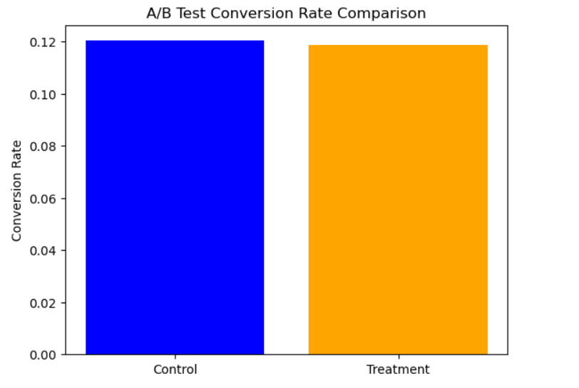

#  A/B Testing Project – Landing Page Conversion Optimization


## Table of Contents
- [About the Project](#about-the-project)
- [Objectives](#Objectives)
- [Tools Used](#Tools)
- [Data Source](#data-source)
- [Project Workflow](#Project-Workflow)
  - [Data Loading and Cleaning](Data-Loading-and-cleaning)
  - [Filtering valid test cases](Filtering-valid-test-cases)
  - [Create separate groups](Create-separate-groups)
  - [Calculate and display conversion rates](Calculate-and-display-conversion-rates)
  - [Import statsmodels for statistical test](Import-statsmodels-for-statistical-test)
  - [Prepare inputs for the z-test](Prepare-inputs-for-the-z-test)
  - [Run the z-test](Run-the-z-test)
  - [Print the test result](Print-the-test-result)
  - [Vizualizing the difference](Vizualizing-the-difference)
  - [Results & Interpretation](Results-&-Interpretation)
- [key Insights](#Key-Insights)
- [Contact](#Contact)


##  Project Overview

This project focuses on conducting a statistical A/B test to evaluate whether a new website landing page leads to a higher user conversion rate compared to the existing version.
- **Objective:** Determine if there's a significant difference in conversion rates between users shown the old landing page (Control group) and those shown the new landing page (Treatment group).

---

##  Tools

- **Language:** Python
- **Libraries:** `pandas`, `statsmodels`, `matplotlib`, `seaborn`
- **IDE/Environment:** Jupyter Notebook
 
---

##  Data Source

- **Source:** [Kaggle – A/B Testing Dataset](https://www.kaggle.com/datasets/zhangluyuan/ab-testing)
- **Features Used:**
  - `user_id`: Unique identifier for each user
  - `group`: Whether the user is in the control or treatment group
  - `landing_page`: The page variant shown to the user
  - `converted`: Whether the user completed the conversion (1 = Yes, 0 = No)
 
---

##  Project Workflow

1. **Data Loading and Cleaning**
```python
df = pd.read_csv("ab_data.csv")
df.head(10)

df['timestamp'] = pd.to_datetime(df['timestamp'])

df.isnull().sum()

df = df.drop_duplicates(subset='user_id')
```
   - Checked for duplicates and nulls
   - Ensured each user saw the correct page based on their assigned group

2. **Filtering valid test cases**
```python
df = df[((df['group'] == 'control') & (df['landing_page'] == 'old_page')) |
        ((df['group'] == 'treatment') & (df['landing_page'] == 'new_page'))]
```
Purpose:
It ensures that Control group saw the old page & Treatment group saw the new page.This line filters out those inconsistent/mismatched records so the A/B test is fair and reliable.


3. **Create separate groups**
```python
control = df[df['group'] == 'control']
treatment = df[df['group'] == 'treatment']
```
Purpose:
Create two subsets of the data — one for the control group and one for the treatment group.

4. **Calculate and display conversion rates**
```python
control_rate = control['converted'].mean()
treatment_rate = treatment['converted'].mean()

print(f"Control conversion rate: {control_rate:.4f}")
print(f"Treatment conversion rate: {treatment_rate:.4f}")
```
Result:
| Group      | Conversion Rate |
|------------|------------------|
| Control    | 12.03%           |
| Treatment  | 11.88%           |

Purpose:
Compute the average conversion in each group. Since converted is a binary column (0 or 1); .mean() gives the proportion of users who converted

5. **Import statsmodels for statistical test**
```python
import statsmodels.api as sm
```
Purpose:
statsmodels is a statistical package in Python used here for performing a proportions z-test.

6. **Prepare inputs for the z-test**
```python
convert = [treatment['converted'].sum(), control['converted'].sum()]
n = [len(treatment), len(control)]
```
Purpose:
The z-test compares two proportions using:
Number of successes (i.e., conversions) in each group → converted.sum()
Sample size in each group → len(group)

So: convert = [# conversions in treatment, # conversions in control]
n = [# users in treatment, # users in control]

7. **Run the z-test**
```python
z_score, p_value = sm.stats.proportions_ztest(convert, n)
```
Purpose:
Perform the two-proportion z-test. It returns:
z_score: how far apart the conversion rates are (in standard deviations)
p_value: the probability that the difference happened by chance

If p_value < 0.05, we conclude the difference is statistically significant.

8. **Print the test result**
```python
print(f"Z-Score: {z_score:.2f}")
print(f"P-Value: {p_value:.4f}")
```
### Results Snapshot

| Group      | Value |
|------------|------------------|
| p-value    | 0.23             |
| z-score    | -1.21            |

Purpose:
Helps us accept or reject the null hypothesis:
If p-value < 0.05, the new page has a significant impact.
If p-value ≥ 0.05, there's no statistically significant difference.

9. **Vizualizing the difference**
```python
plt.bar(['Control', 'Treatment'], [control_rate, treatment_rate], color=['blue', 'orange'])
plt.ylabel('Conversion Rate')
plt.title('A/B Test Conversion Rate Comparison')
plt.show()
```


10. **Results & Interpretation**
   - No statistically significant difference found (p > 0.05).
   - Recommendation: Keep current landing page as the default.
     
---

## **Key Insights**

- The new landing page did not significantly improve conversion rates, as the p-value (0.23) was well above the 0.05 threshold.

- Despite a minor difference in conversion rates (12.04% vs. 11.88%), it was not statistically significant, suggesting the new design may not offer a measurable benefit.

- Emphasized the importance of clean experimental setup — aligning test groups and ensuring no cross-contamination in control/treatment exposure.

- Demonstrated end-to-end application of hypothesis testing using real-world product data — a critical skill in data-driven decision making.

## **Contact info**
**Sahil Patra**  
GitHub: [Github-page](https://github.com/Sahil-Patra)  
Email: sahilpatra1004@gmail.com
Ph no.: +91 7735367833
---

**Thank you for checking out this project!** 


---
